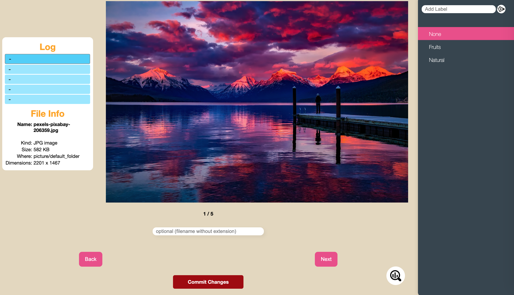

# Image Labeller
A simple Flask web app that helps you organise tons of images into different 'labels' of folders. It may be use to segregate images for training AI.

## Interface


## Features
- Responsive web app design
- Image statistics
- Progress statistics
- Built-in automatic naming algorithm (e.g., 000.png/001.jpeg)
    - Suitable for custom naming

## What It Is Not
- Image annotation
- Cropping sections of image

## How To Use
1. Run `flask_run.py`

### How to Add Label?
Add label by creating folder only in `static/picture` folder, then update the `LABELS` as so.
```python
LABELS = {"None": None,
            "Fruits": ["static", "picture/fruits"],
            "Natural": ["static", "picture/natural"]
}
```

### Where to Store Unsorted Image
Flask retrieve image **only** in static folder. The web app is designed to retrieve image from 'picture/default_folder'. Store image under `classifier/static/picture/default_folder`. When changing the directory of the retrieve image, code below must be change to the new directory.
```python
static_extraction = "picture/default_folder"
```

## License
[MIT](https://choosealicense.com/licenses/mit/)